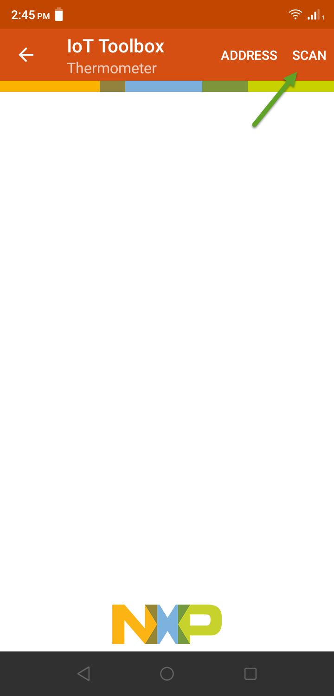

# MaaXBoard-RT-V3--Peripheral_HT <!-- omit in toc -->

Application demonstrating the BLE Peripheral role, except that this application specifically exposes the HT (Health Thermometer) GATT Service. Once a device connects it will generate dummy temperature values.

# Table of Contents <!-- omit in toc -->
- [Required Hardware](#required-hardware)
  - [MaaXBoard-rt-board](#maaxboard-rt-board)
  - [MCU-Link debug probe](#mcu-link-debug-probe)
  - [A device running IoT Toolbox from NXP](#a-device-running-iot-toolbox-from-nxp)
- [Preparing the Demo](#preparing-the-demo)
- [Running the demo](#running-the-demo)
- [On your device](#on-your-device)
- [Reference](#reference)
# Required Hardware

## MaaXBoard-rt-board 

- NXP i.MX RT1176 Processor
- Arm Cortex-M7 @1GHz, 32KB/32KB L1 Cache
- Arm Cortex-M4F @400MHz, 16KB/16KB L1 Cache
- Fast Real-time, low-latency response (12ns)
- 2D GPU and Graphics Accelerator
- Advanced Security (on RT1176 plus TO136 Device)
- 2MB of Fast On-Chip SRAM
- (includes 512KB of A7 TCM and 256KB M4 TCM)
- 256 Mb Onboard SDRAM
- 256 Mb Onboard HyperFlash

## MCU-Link debug probe

## A device running IoT Toolbox from NXP

IoT Toolbox can be downloaded freely wherever you get your apps.

# Preparing the Demo
1.  Open the project and build it.
   
2.  Connect a USB cable between the PC host and the OpenSDA USB port on the target board.

3.  Open a serial terminal on PC for OpenSDA serial device with these settings:
    - 115200 baud rate
    - 8 data bits
    - No parity
    - One stop bit
    - No flow control
  
4.  Download the program to the target board.

5.  Either press the reset button on your board or launch the debugger in your IDE to begin running the example.

# Running the demo

The demo does not require user interaction. The application will automatically start advertising the Health Thermometer Service and it will accept the first connection request it receives. 
If the peer subscribes to receive temperature indications, these will be sent every 1 second. 
The temperature readings are simulated with values between 20 and 25 degrees Celsius.

# On your device
To view the thermometer reading on your device:

1. Open the IoT Toolbox app.
2. Select Thermometer.  
3. Press Scan. if already scanning, press stop and then Scan  
4. Select the peripheral_ht device once it apears.  
5. Temperature readings will begin to cycle.  

# Reference

* [MaaXBoard-rt](https://www.avnet.com/wps/portal/us/products/avnet-boards/avnet-board-families/maaxboard/maaxboard-rt/)